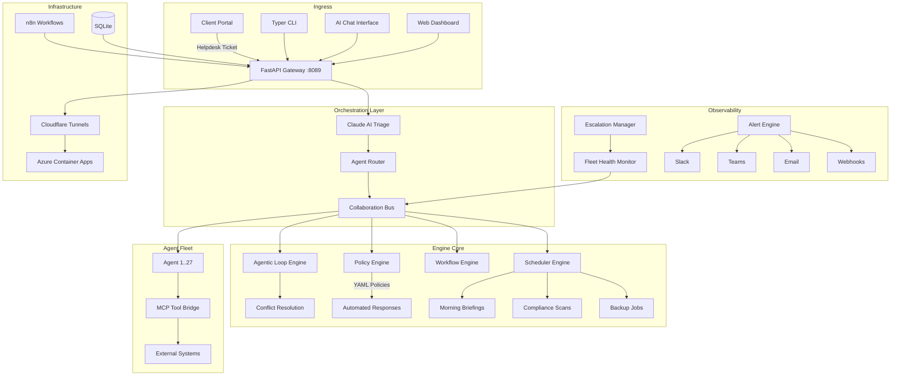

<div align="center">

# Fleet Orchestrator

### The Central Intelligence Layer for Autonomous IT Operations

[](https://python.org)
[](https://fastapi.tiangolo.com)
[](https://anthropic.com)
[](https://docker.com)
[](https://azure.microsoft.com)
[](LICENSE)

---

**Fleet Orchestrator** is a production-grade meta-agent that coordinates 27 specialized AI agents to deliver fully autonomous IT operations. It accepts helpdesk tickets from a client portal, triages them with Claude AI, routes to the correct specialist agent, executes resolution autonomously, and sends branded email confirmations — all without human intervention.

Built by **David Lopez** | [VoltSys.ai](https://voltsys.ai)

</div>

---

## Architecture



---

## Key Features

| Category | Capability |
|----------|-----------|
| **Multi-Agent Coordination** | Bus-based collaboration protocol enabling 27 agents to share context, delegate subtasks, and resolve conflicts autonomously |
| **Agentic Loop Engine** | Multi-iteration autonomous problem solving — agents reason, act, observe, and iterate until resolution |
| **Intelligent Triage** | Claude AI classifies incoming tickets by urgency, category, and required expertise, then routes to the optimal agent |
| **Policy Engine** | YAML-defined policies enforce organizational rules and trigger automated responses without code changes |
| **Workflow Engine** | Declarative YAML workflows define multi-step processes with branching, retries, and rollback semantics |
| **Scheduled Operations** | Morning briefings, compliance scans, backup verification, and credential rotation on configurable schedules |
| **Escalation Management** | Business-hours-aware escalation paths with configurable SLA thresholds and notification chains |
| **Alert Engine** | Multi-channel alerting (Slack, Teams, Email, Webhooks) with severity filtering and deduplication |
| **Fleet Health Monitoring** | Real-time agent health checks, process management, and automatic recovery of failed agents |
| **Credential Rotation** | Automated secret rotation with zero-downtime rollover and audit logging |
| **Model Context Protocol** | MCP server + tool bridge enabling agents to invoke external tools through a standardized interface |
| **Triple Interface** | Web dashboard, CLI, and AI chat — all backed by the same orchestration core |

---

## Tech Stack

| Layer | Technology |
|-------|-----------|
| **Language** | Python 3.11+ |
| **API Framework** | FastAPI (async, OpenAPI docs, Pydantic validation) |
| **AI / LLM** | Claude AI (Anthropic) via Model Context Protocol |
| **Workflow Automation** | n8n (event-driven pipelines) |
| **Data Validation** | Pydantic v2 |
| **Database** | SQLite (lightweight, zero-config persistence) |
| **Containerization** | Docker |
| **Deployment** | Azure Container Apps |
| **Networking** | Cloudflare Tunnels (zero-trust ingress) |
| **CLI** | Typer |
| **Configuration** | YAML (policies, workflows, schedules) |

---

## Getting Started

### Prerequisites

- Python 3.11+
- Docker (optional, for containerized deployment)
- Anthropic API key
- n8n instance (for workflow automation triggers)

### Installation

```bash
# Clone the repository
git clone https://github.com/bboydaves-afk/fleet-orchestrator.git
cd fleet-orchestrator

# Create virtual environment
python -m venv .venv
source .venv/bin/activate  # Linux/macOS
.venv\Scripts\activate     # Windows

# Install dependencies
pip install -r requirements.txt

# Configure environment
cp .env.example .env
# Edit .env with your API keys and preferences
```

### Running

```bash
# Initialize the database and core systems
python run.py init

# Start the web dashboard and API server (port 8089)
python run.py web

# Launch the CLI interface
python run.py cli

# Start the AI chat interface
python run.py chat
```

---

## Project Structure

```
fleet-orchestrator/
├── run.py                          # Entry point (init/cli/web/chat modes)
├── config.yaml                     # Global configuration
├── requirements.txt                # Python dependencies
│
├── engines/
│   ├── agentic_loop_engine.py      # Multi-iteration autonomous reasoning
│   ├── orchestration_engine.py     # Agent routing and coordination
│   ├── fleet_monitoring_engine.py  # Health checks and recovery
│   ├── policy_engine.py            # Rule evaluation and enforcement
│   ├── workflow_engine.py          # YAML workflow execution
│   ├── scheduler_engine.py         # Cron-like job scheduling
│   ├── alert_engine.py             # Multi-channel notifications
│   ├── escalation_manager.py       # SLA and business-hours routing
│   ├── briefing_engine.py          # Automated status reports
│   ├── backup_engine.py            # Backup orchestration
│   ├── credential_rotation.py      # Secret lifecycle management
│   └── process_manager.py          # Agent process supervision
│
├── interfaces/
│   ├── ai_agent/
│   │   ├── agent.py                # Core agent logic
│   │   ├── tools/                  # Agent tool definitions
│   │   ├── handlers/               # Event and message handlers
│   │   └── safety.py              # Guardrails and safety checks
│   ├── web/                        # FastAPI dashboard
│   │   └── routes/                 # agents, alerts, chat, workflows, policies
│   └── cli/                        # Typer CLI application
│
├── mcp/
│   ├── server.py                   # Model Context Protocol server
│   └── tool_bridge.py             # External tool integration layer
│
├── core/
│   ├── database.py                 # SQLite connection and migrations
│   ├── credentials.py              # Secret management
│   └── models.py                   # Pydantic domain models
│
└── data/
    ├── policies/                   # YAML policy definitions
    └── workflows/                  # YAML workflow definitions
```

---

## How It Works

1. **Ticket Ingress** — A helpdesk ticket arrives via the client portal, API, or n8n webhook trigger.
2. **AI Triage** — Claude AI analyzes the ticket content, classifies urgency and category, and determines which specialist agent(s) are required.
3. **Agent Routing** — The orchestration engine routes the task to the appropriate agent(s) via the collaboration bus.
4. **Autonomous Execution** — The agentic loop engine drives multi-step resolution: the agent reasons about the problem, invokes tools via MCP, observes results, and iterates until the issue is resolved.
5. **Conflict Resolution** — When multiple agents operate on overlapping resources, the conflict resolution system arbitrates based on priority and policy.
6. **Confirmation** — Upon resolution, the system sends a branded email confirmation to the end user and logs the full execution trace.

---

## License

This project is licensed under the MIT License.

---

<div align="center">

**Built by [David Lopez](https://github.com/bboydaves-afk) | VoltSys.ai**

*Turning 27 specialized AI agents into one autonomous IT operations platform.*

</div>
